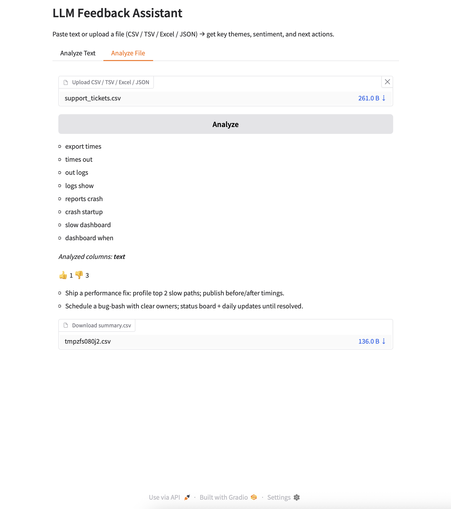
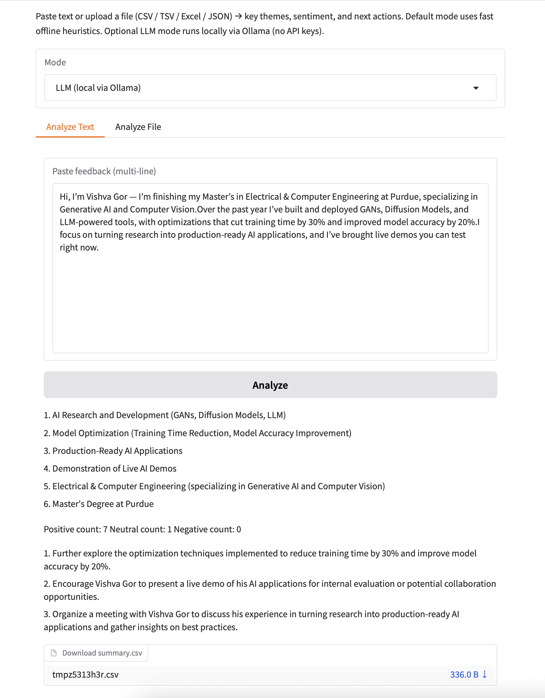

# Feedback Assistant — Offline + Local LLM (No API Keys)

[](LICENSE)
[](../../actions/workflows/smoke.yml)


Turns raw feedback into **key themes**, **sentiment (👍/👎)**, and **next actions**.  
Runs fully **offline** by default (fast heuristics). Optionally switch to a **local LLM via Ollama**—still **no API keys** or cloud dependencies.

> **Use cases:** VOC/CX reviews, support ticket triage, product reviews, course surveys.

---

## Screenshot

> Replace with a real screenshot from your machine.




---

## Modes

- **Offline heuristics (default)** — fast, deterministic, keyless; robust on messy files.  
- **Local LLM (Ollama)** — richer summaries on-device (e.g., `mistral`, `llama3`); privacy-preserving and still keyless.

---

## Quickstart

```bash
git clone https://github.com/Vishvagor/llm-feedback-assistant
cd llm-feedback-assistant

# (optional) virtual env
python -m venv .venv && source .venv/bin/activate   # Windows: .venv\Scripts\Activate

pip install -r requirements.txt

### Enable Local LLM (optional)
1) Install Ollama: https://ollama.com  
2) Pull a model:
```bash
ollama pull mistral   # or: ollama pull llama3


# run (module mode avoids import issues)
python -m app.app
